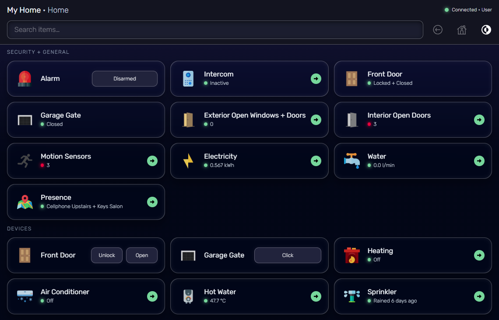
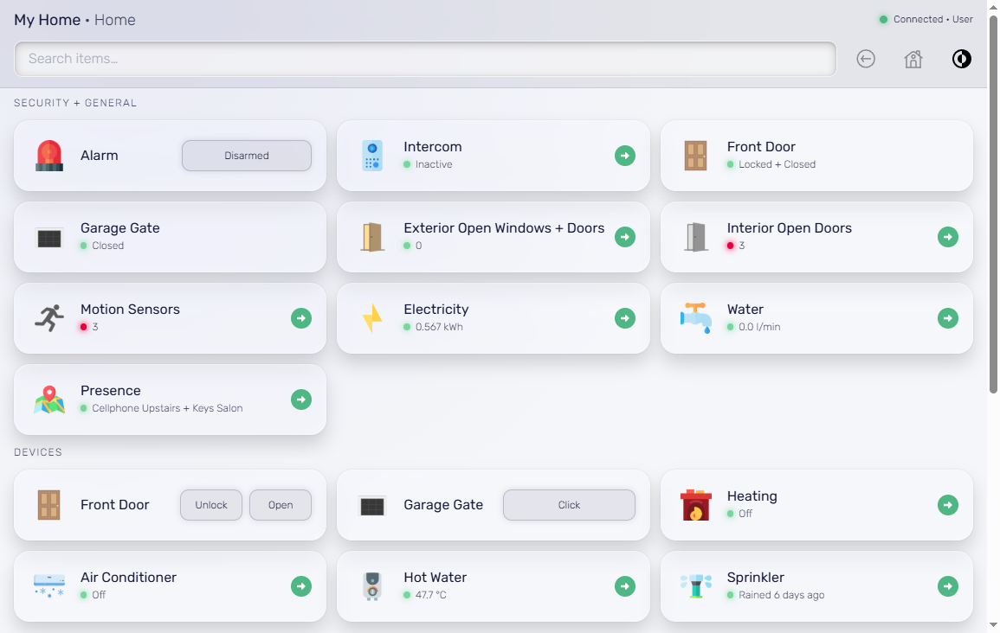
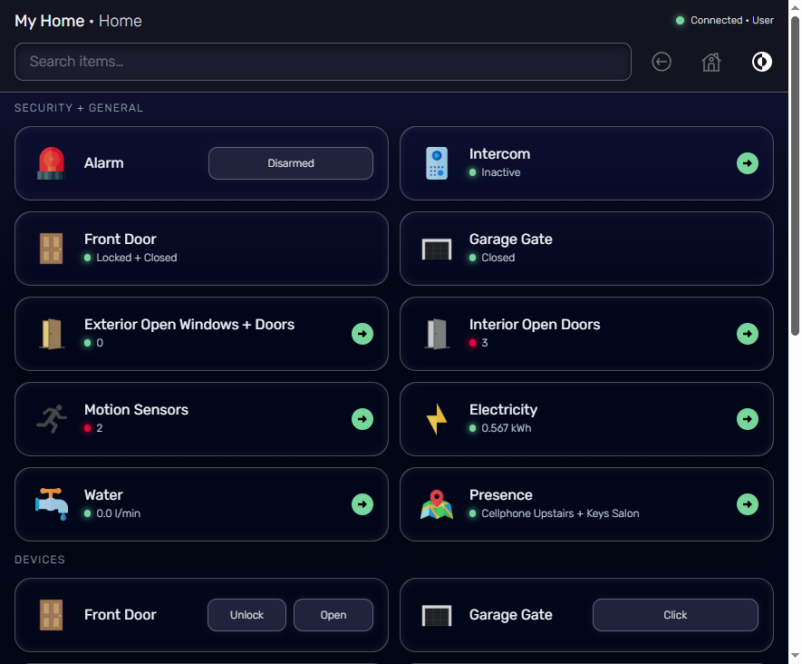
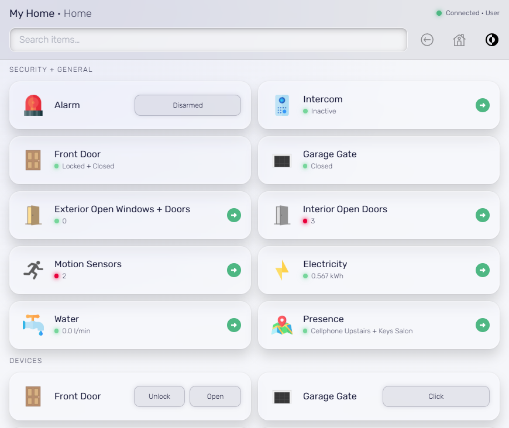
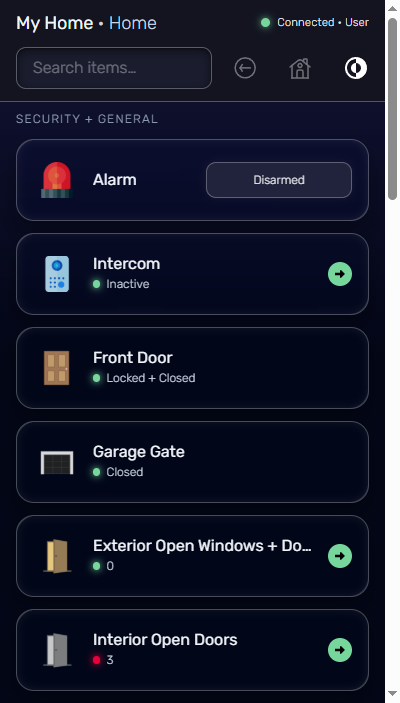
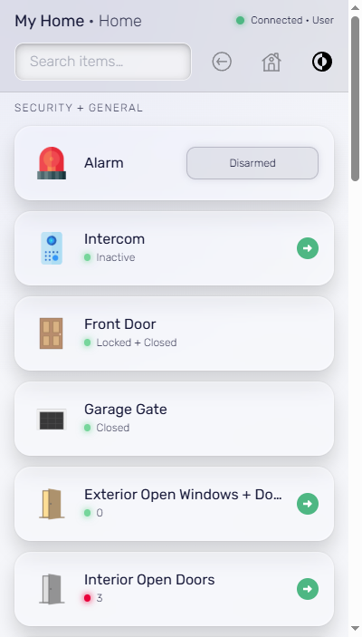

# ohProxy

A modern, secure reverse proxy and web interface for [openHAB](https://www.openhab.org/). ohProxy provides a responsive Progressive Web App (PWA) with real-time updates, touch-optimized controls, and comprehensive security features.

**openHAB Compatibility:**

| Version | Status | Real-time Mode | Notes |
|---------|--------|----------------|-------|
| 1.8.3 | Tested | Atmosphere | Confirmed working |
| 2.x | Unknown | Atmosphere | Not yet tested |
| 3.4 | Tested | SSE | Confirmed working |
| 4.3 | Tested | SSE | Confirmed working |
| 5.1 | Tested | SSE | Confirmed working |

## Overview

ohProxy sits between your users and openHAB, providing:

- **Modern UI**: Glass-morphism design with dark/light themes
- **Mobile-first**: Touch gestures, haptic feedback, PWA installation
- **Security**: Authentication, IP allowlists, auth lockout, security headers
- **Real-time**: WebSocket updates with intelligent polling fallback
- **Offline support**: Service worker caching for reliable access

## Screenshots

### Desktop (3-column layout)

| Dark Mode | Light Mode |
|-----------|------------|
|  |  |

### Tablet (2-column layout)

| Dark Mode | Light Mode |
|-----------|------------|
|  |  |

### Phone (1-column layout)

| Dark Mode | Light Mode |
|-----------|------------|
|  |  |

## Features

### User Interface
- Dark/Light modes with responsive grid (1/2/3 columns)
- Header modes: full, small, or hidden
- Slim mode for embedded displays
- Real-time search across all items

### Interactive Controls
- Switch, Selection, Slider/Dimmer widgets
- Image with MJPEG streaming and zoom viewer
- Video with RTSP to MP4 conversion
- Chart with caching and auto-refresh
- Webview with iframe embedding

### Real-Time Updates
- Polling, Atmosphere (OH 1.x/2.x), or SSE (OH 3.x+) modes
- Smart active/idle polling intervals
- Delta updates to minimize bandwidth

### Security
- HTTP Basic or form-based authentication
- Cookie-based sessions with HMAC signing
- IP allowlists, auth lockout, HSTS, CSP headers

### PWA Features
- Installable on mobile devices
- Offline support via service worker
- Haptic feedback and pull-to-refresh

## Installation

### Prerequisites

- Node.js 18+
- openHAB with REST API enabled
- ImageMagick (for icon conversion)
- (Optional) TLS certificates for HTTPS
- (Optional) FFmpeg for RTSP streaming

### Setup

1. Clone the repository:
   ```bash
   git clone https://github.com/JPITSG/ohProxy.git
   cd ohProxy
   ```

2. Install dependencies:
   ```bash
   npm install
   ```

3. Create configuration file:
   ```bash
   cp config.defaults.js config.local.js
   ```

4. Edit `config.local.js` with your settings (see [Configuration](https://github.com/JPITSG/ohProxy/wiki/Configuration))

5. Start the server:
   ```bash
   node server.js
   ```

### Running as a Service

Example systemd service file (`/etc/systemd/system/ohproxy.service`):

```ini
[Unit]
Description=ohProxy - openHAB Reverse Proxy
After=network.target

[Service]
Type=simple
User=openhab
WorkingDirectory=/opt/ohProxy
ExecStart=/usr/bin/node server.js
Restart=on-failure
RestartSec=10

[Install]
WantedBy=multi-user.target
```

## Documentation

See the [Wiki](https://github.com/JPITSG/ohProxy/wiki) for detailed documentation:

- [Configuration](https://github.com/JPITSG/ohProxy/wiki/Configuration) - Server, authentication, security headers, WebSocket, MySQL
- [Usage Guide](https://github.com/JPITSG/ohProxy/wiki/Usage-Guide) - URL parameters, proxy endpoints, streaming, GPS map
- [CMD API](https://github.com/JPITSG/ohProxy/wiki/CMD-API) - Simple HTTP endpoint for sending commands to OpenHAB items
- [CLI Tools](https://github.com/JPITSG/ohProxy/wiki/CLI-Tools) - User and session management
- [Performance Tips](https://github.com/JPITSG/ohProxy/wiki/Performance-Tips) - Optimization recommendations
- [Testing](https://github.com/JPITSG/ohProxy/wiki/Testing) - Running the test suite

## Browser Support

- Chrome/Edge 80+
- Firefox 75+
- Safari 13+
- iOS Safari 13+
- Android Chrome 80+

## License

MIT License - See LICENSE file for details.
